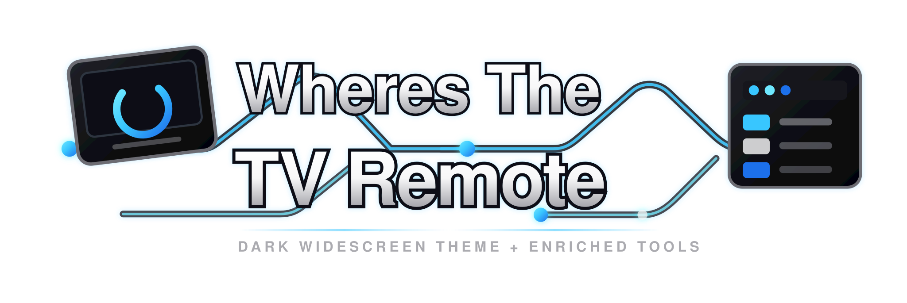

  

<h1 align="center">WheresTheTVRemote</h1>

<em>A modern dark widescreen theme paired with a modular companion userscript.</em>

  
  
  
  
  

---

## Overview

The stylesheet restyles the site; the userscript *adds* to it — a bundle of tools
that enrich the TV series experience, all managed from a single panel on your
profile settings page.

Everything is modular. Each feature has its own on/off switch, so you can run the
whole set or only the parts you want.

| Asset | URL |
|---|---|
| Stylesheet | `https://Im-That-Guy-16.github.io/wheresthetvremote/WheresTheTVRemote.css` |
| Userscript | `https://Im-That-Guy-16.github.io/wheresthetvremote/WheresTheTVRemote.user.js` |

## Install

### Stylesheet

Point a userstyle manager such as [Stylus](https://add0n.com/stylus.html), or your
profile's stylesheet setting, at the CSS URL above.

Fonts and images are linked as absolute URLs back to the Pages host, so the sheet
renders correctly whether it is linked by URL or pasted in as text.

### Userscript

1. Install [Tampermonkey](https://www.tampermonkey.net/) (recommended) or
   [Violentmonkey](https://violentmonkey.github.io/).
2. Open the userscript URL above; your manager will offer to install it.
3. Confirm the install.

The script carries its own update URL, so new versions are pulled automatically.

> Pairs best with the stylesheet. The script reads the theme's colour variables so
> it blends in, but renders fine on its own.

## Configuration

Your profile settings page gains two panels:

- **Userscript Manager** — a switch for every feature, plus a slot for API keys.
- **Sonarr Settings** — multi-server Sonarr configuration.

Toggling a feature off stops it running but keeps its settings.

### API keys

Keys are entered as plain text, so your browser's password manager will not
interfere. Sensible defaults are baked in; supply your own only if you prefer.

| Key | Used by |
|---|---|
| Fanart.tv | Logo and artwork features |
| TMDb | Trending, cast, season synopsis, recommendations, season browser, trailer, actor search and showcase, summary |

## Features

| Feature | What it does |
|---|---|
| **Sonarr integration** | One or more servers with connection testing, default quality profile, root folder and monitor option. Each server appears as a colour-coded link on the series actions bar — green if the show is already in that library, red to add it in one step. |
| **Fanart.tv logo** | Places the show's HD clear logo at the top of the series sidebar. |
| **Enhanced series hero** | Replaces the native banner slot with a compact TMDb-powered hero at the same dimensions. |
| **Latest season synopsis** | A compact card under the poster when TMDb has an overview for the latest season, sliding open on click. |
| **IMDb Parents Guide** | Colour-coded severity cards with top notes, vote bars, spoiler blur and a UK certificate badge. Collapsed by default, cached 7 days. |
| **Homepage TMDb row** | Trending, popular, top-rated, airing today or on-air shows, each linking to a site search with a hover info card. |
| **Homepage stats and featured cards** | A stats strip plus enriched Featured Series and Featured Actor panels. |
| **Sonarr upcoming** | A sidebar card showing episodes due today and tomorrow, grouped by date. |
| **Recommendation modal** | Replaces the sparse info popup with a TMDb-rich modal: artwork, synopsis, metadata, ratings, episode cards, cast and external links. |
| **Artwork placeholders** | Theme-matched placeholders wherever "no poster / no banner / no fan art" defaults appear. |
| **Hide empty requests** | Hides the Requests section on a series page when there are none open. |
| **Collapse old seasons** | Collapses all but the most recent season, and repairs the built-in show/hide links. |
| **Trailer player** | A clean pop-up player that restores the stripped referrer (the cause of the "Error 153" failure), with a TMDb lookup when no trailer is on file. |

## Licence

Released under the [MIT Licence](LICENSE).
